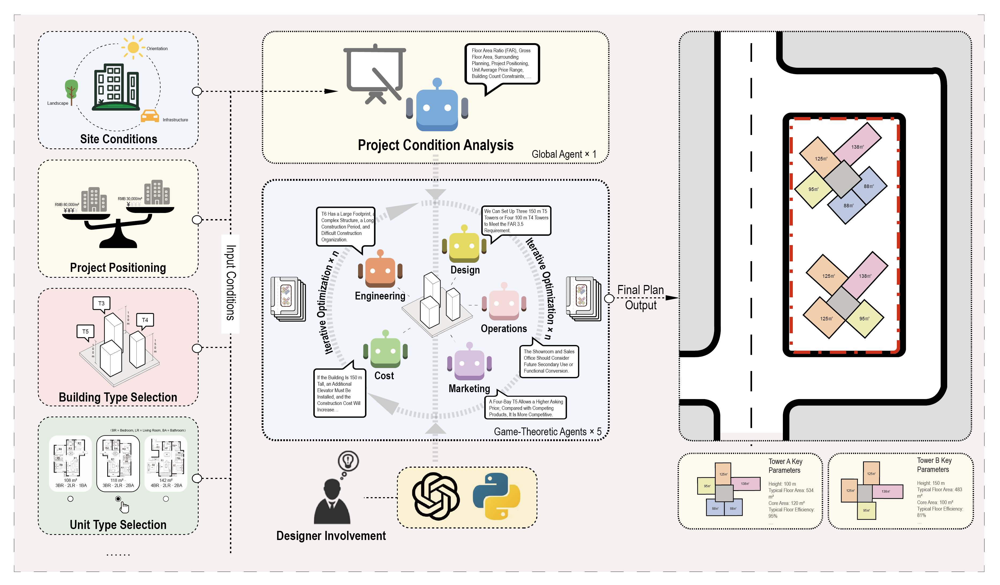

# EnergAI: A Large Language Model–Driven Generative Design Method for Early-Stage Building Energy Optimization
Abstract: *Early-stage planning in architectural development strongly influences project quality, cost, and sustainability across the building life cycle. In practice, this stage involves multiple stakeholders, such as design, cost, market, engineering, and operations, whose objectives and information sources are often heterogeneous and difficult to coordinate. To address this challenge, we propose PlanGPT-MAS, a multi-agent large language model framework for early-stage decision-making in complex architectural development. First, we construct ArchPlan-Multimodal, a multimodal dataset based on 120 real residential development cases, integrating textual documents and architectural drawings across design, cost, market, construction, and operations. Second, we develop a multi-agent framework that combines retrieval-augmented generation, Actor-Critic weight optimization, and multi-round negotiation to support dynamic objective balancing and explainable decision-making. Third, experiments including baseline comparison, ablation studies, robustness analysis, and expert evaluation demonstrate the effectiveness of the proposed method. PlanGPT-MAS achieves an average expert-reference alignment score of 0.8410, outperforming EqualWeight by 3.57% and RandomWeight by 11.96%. This automated metric indicates stronger consistency with expert-annotated planning references, while blind expert evaluation further assesses feasibility, coordination, interpretability, and professional acceptability. Rather than directly generating better architectural designs, PlanGPT-MAS provides an interpretable decision-support framework that structures competing priorities and makes their trade-offs explicit while retaining human oversight.*


[**Paper**]() | [**Project Page**]() | [**Model Weights**]() | [**Huggingface Demo**]() |


*Figure 1) Graphical Abstract*


*Figure 2) Example Planning Outcomes under Different Agent Priorities and Site Constraints. The four cases illustrate different planning priorities under varying agent weights. Agent weights represent relative disciplinary priorities rather than direct geometric rules, while the final layouts are jointly shaped by site-specific constraints.*


*Figure 3) Overview of the ArchPlan-Multimodal Framework*


*Figure 4) Overview of the PlanGPT-MAS Framework*


*Figure 5) (a) Impact of removing individual agents on test reward,  (b) Effect of negotiation rounds on train/test reward*


*Figure 6) Seed stability analysis: (a) per-case reward distribution, (b) average test reward per seed. Robustness analysis: (c) weight noise injection, (d) agent dropout*


*Figure 7) Multi-round iterative negotiation in Case #5: evolution of agent weights and scheme outputs*


*Figure 8)(a) Agent weight evolution during negotiation (Case #5), (b) Best agent weight distribution across all 48 cases*


*Figure 9) Expert Evaluation and Validation of PlanGPT-MAS *


## Table

*Baseline comparison on ArchPlan-Multimodal dataset.*


*Ablation study results.*


## TODO List

- [x] Complete the shape-optimised beam-and-block prototype.
- [ ] Release the parametric optimisation code and fabrication files.
- [ ] Upload the embodied-carbon assessment data.
- [ ] Complete structural and ceramic-material testing.
- [ ] Integrate thermal-performance optimisation.
- [ ] Adapt the system to different building codes and manufacturing contexts.


## Inference

```
python EnergAI_Infer.py --dataset ArchPlan-Multimodal --model_path ckpts/EnergAI/model_final.pt --prompt_strategy performance-oriented
```
## Train

```
python EnergAI_Train.py --dataset ArchPlan-Multimodal --output_dir ckpts/EnergAI --prompt_strategy performance-oriented
```

